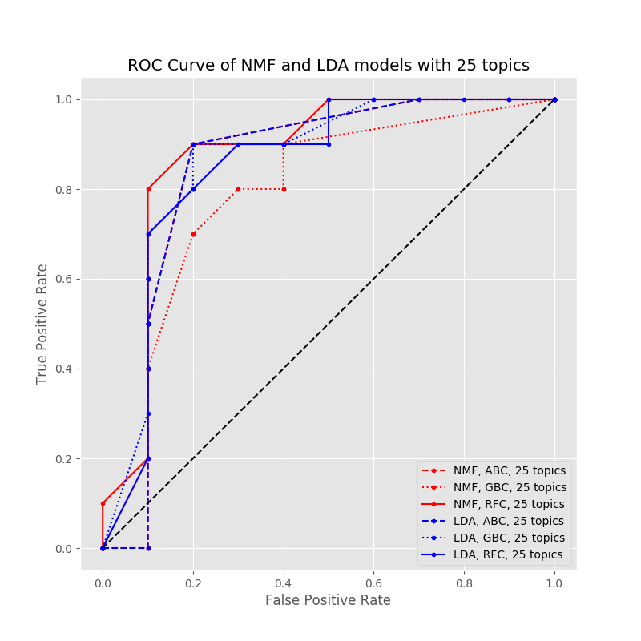

# Reddit Nut-Meter

---
Using NLP techniques and Machine Learning algorithms, this proof-of-concept project profiles extremists on Reddit.

**Due to the nature of this study, some of this material could be offensive to some readers.**

---

Reddit.com is an online forum where users can discuss whichever topics they wish in small groups called 'subreddits.' A popular website, 4th largest in the [United States](http://www.alexa.com/topsites/countries/US), that has been plagued by [radical groups](https://www.washingtonpost.com/news/the-intersect/wp/2015/06/10/these-are-the-5-subreddits-reddit-banned-under-its-game-changing-anti-harassment-policy-and-why-it-banned-them/) over its lifetime. Lately you can see how [certain subreddits](https://www.reddit.com/r/uncensorednews/comments/6eewxz/migrants_caught_stealing_flowers_soft_toys_from/) have been responding to recent events in global politics. Beyond a security standpoint, there is motivation to profile these people for the sake of other users on Reddit. I don't like discussing politics with Neo-Nazis. If someone supports domestic abuse, I don't want their opinion on PC parts. So anyone who is a 'nut' is someone I'd like to avoid on this website.

---

#### What makes a nut?

A nut is defined as someone who either defends acts of sexual assault, or incites violence along racial, religious, or gender lines (Violent Hate Speech).

---

## Data  

Using a python module called [PRAW](https://praw.readthedocs.io/en/latest/) (Python Reddit API Wrapper), I started collecting comments for the study. Since the end-goal was to use predictive modeling to identify new users, I knew I needed to label my data as either a confirmed 'nut' or 'non-nut.' I started by going to certain subreddits that I knew I could find nuts in.

| Subreddit         |Subscriber Size|
| ------------------|:-------------:|
| conspiracy        | 460k          |
| the_donald        | 425k          |
| theredpill        | 206k          |
| pusspassdenied    | 143k          |
| uncensorednews    | 111k          |
| sjwhate           | 31k           |
| MGTOW             | 26k           |
| pusspass          | 25k           |
| redpillwomen      | 17k           |
| incels            | 15k           |
| whiterights       | 11k           |
| darkEnlightenment | 11k           |
| thiscrazybitch    | 7k            |
| physical_removal  | 6k            |
| new_right         | 6k            |
| pol               | 6k            |
| feminstpassdenied | 4k            |
| nationalsocialism | 3k            |

In each subreddit, I searched through comments until I found one that aligned with the definition of a nut. But one radical comment was not enough to label a user a nut, I had to make sure this behavior had been repeated. Another complication, if this was the only type of activity on their account, then it was likely an alternate account that they are using to discuss their radical ideas. That's a problem because those users never go to normal subreddits anyway, and wouldn't be interacted with 'in the wild.' So I had to pick a balance of some normal and some extremist activity. This tedious process was aided greatly by the use of a website called [SnoopSnoo](https://snoopsnoo.com/). SnoopSnoo collects up to the last 1000 comments from the user of interest and profiles their activity. You can get a breakdown of the subreddits they visit, lifestyle choices, and hobbies. Using SnoopSnoo, I was able to validate my choice for 'nuts' and 'non-nuts.'

*Note, SnoopSnoo does not have 'extremist' functionality. That must be interpreted by the investigator.*

After finding 40 nuts, I used a similar process to find users who could safely be labeled as 'not-nuts'. They were found in normal subreddits like the ones found [here](http://redditlist.com/). With 80 labeled users, I used PRAW to collect up to their last 1000 comments (reddit API limits). However, the amount of vocabulary contained by 80 users would not be enough for the NLP analysis. So 200 users were randomly selected from the 'nut' subreddits in the table and 200 more from the 'non-nut' subreddits in the link. All in all, my corpus (collection of comments) had 480 users, 304k comments, with an average of 192 words per comment.

**Testing Data**

Two weeks after the original 480 user corpus was scraped, 10 more nuts and 10 more non-nuts were found and labeled. These users were to be only used in the evaluation of the predictive models. No NLP transform, algorithm or predictive model was trained on these 20 users.

*Note, the purpose behind getting the testing users 2 weeks later is that the relevant topics (politics) have changed and I want to make sure the predictive model works on new vocabulary data.*

---

## Topic Modeling

In order to get a computer to make sense of the comments we need to do three things to the corpus:

1. Clean the comments
2. Vectorize comments into numbers
3. Label the topic that the comment is discussing

There will be two competing methods for topic modeling which will be evaluated afterwards with predictive models.

### Cleaning

Using regex, most of the punctuation was stripped from the comments and several contractions were translated. One noteworthy bit of punctuation that was kept was the use of triple parentheses. In white nationalist groups, the use of triple parentheses around a name or group of people is a way to tell other forum-goers that this person is a jew. [Example 1](https://www.reddit.com/r/PoliticalHumor/comments/6h8nnb/the_muslim_ban/dixede1/?context=3), [Example 2 (title)](https://www.reddit.com/r/WhiteRights/comments/5auxfm/who_opened_the_borders_jews_plotted_and/). Anytime a triple parentheses was used, the inside word was deleted and what was fed into the vectorizers was '((()))'.

### Vectorizing

Vectorizing has to do with transforming the words in the comments into numbers a computer can interpret. This was done in two methods as the two different topic models used later receive different vectorizers.

**Term Frequncy**

The first vectorizer, called a Count Vectorizer, makes a matrix of *term frequencies* based on the words that appear in the corpus.

Example

* Sentence 1: "the dog ran up the street"
* Sentence 2: "a car ran past a stop sign"
* Sentence 3: "a child ran in the street"

The resulting term-frequency matrix looks like this:

|          |car|child|dog| in|past|ran|sign|stop|street|the| up|
|----------|:-:|:---:|:-:|:-:|:--:|:-:|:--:|:--:|:----:|:-:|:-:|
|Sentence 1| 0 | 0   | 1 | 0 | 0  | 1 | 0  | 0  | 1    | 2 | 1 |
|Sentence 2| 1 | 0   | 0 | 0 | 1  | 1 | 1  | 1  | 0    | 0 | 0 |
|Sentence 3| 0 | 1   | 0 | 1 | 0  | 1 | 0  | 0  | 1    | 1 | 0 |

This matrix can be interpreted as the importance of each word to each document (Documents in this sense being sentences, but in the context of this study the documents are user comments). The higher the number, the more important that word is to the document. It's easy to see how common words like 'a' or 'the' could be mislabeled as important. To combat this we exclude these words, now called 'stop words'. The term-frequency matrix looks considerably more informative after removing the stop words.

|          |car|child|dog|ran|sign|stop|street|
|----------|:-:|:---:|:-:|:-:|:--:|:--:|:----:|
|Sentence 1| 0 | 0   | 1 | 1 | 0  | 0  | 1    |
|Sentence 2| 1 | 0   | 0 | 1 | 1  | 1  | 0    |
|Sentence 3| 0 | 1   | 0 | 1 | 0  | 0  | 1    |

Looking at the words left over we can still make sense what each sentence is discussing.

* Sentence 1: dog, ran, street
* Sentence 2: car, ran, sign, stop
* Sentence 3: child, ran, street

**Tf-Idf**

Tf-Idf (Term frequency-Inverse document frequency) accomplishes the same goal of quantizing importance of words to documents but in a different fashion. Firstly, notice the 'Tf' part of 'Tf-Idf'. This part of the transformation does exactly what the Count Vectorizer does. The 'Idf' part is how the Tf-Idf Vectorizer distinguishes itself. The Idf value for each j-th element in the Tf matrix is expressed as:

https://moz.com/blog/inverse-document-frequency-and-the-importance-of-uniqueness

Each value in the Tf matrix is multiplied by its Idf value. This rewards uniqueness and penalizes words that appear in multiple documents but aren't included as stop words.

### Topic Modeling

In this section, we use two different matrix algorithms to discover the topics in each comment.

**NMF**

NMF, or Non-negative Matrix Factorization, is a way to break a single matrix into two different matricies which when multiplied together are approximately the orginal matrix. The matrix of interest would be the one from our Tf-Idf vectorizer.

https://en.wikipedia.org/wiki/Non-negative_matrix_factorization

The reasoning behind this is that if we originally had N comments and M words in our vectorizer matrix we could break it down into an N x k and k x M matrices. What does the number k represent? K is a hyperparameter in NMF which decides he number of latent topics used in the decomposition of the vectorizer matrix. Then, setting W as the ouptut from our NMF, we have a new matrix which represents the importance of topics to each comment.

Example: Document-Topic Matrix

|           | topic_0 | topic_1 | topic_2 | topic_3 | topic_4 |
|-----------|:-------:|:-------:|:-------:|:-------:|:-------:|
| comment_0 |  8      |  5      |  1      |  5      | 0       |
| comment_1 |  1      |  0      |  2      |  3      | 1       |
| comment_2 |  0      |  4      |  1      |  2      | 0       |

Each comment is then labeled as whichever topic is most important to it.

|           | topic # |
|-----------|:-------:|
| comment_0 |  0      |
| comment_1 |  3      |
| comment_2 |  1      |

**LDA**

LDA, or Latent Dirichlet Allocation, is another matrix decomposition algorithm but goes about it in a completely different way than NMF. Firstly, LDA is not a linear algebra approximation technique but a generative statistical model. It relies on the probabilities of term frequencies to make inferences of topic importances. For this reason it uses the vanilla term-frequency matrix as input. Once the vectorizer is decomposed into a Document-Topic matrix and Topic-Word Matrix (akin to the W & H matrices returned from NMF), we label each comment's topic as we did when labeling after NMF, by finding the most important topic in the Document-Topic matrix.

**Topic Modeling Notes**

* There were 6 topic models each for both LDA and NMF that were trained. Each one having a different number of topics ranging from 25 to 150 in increments of 25.

---

## Predictive Modeling

Now that each comment is a number, and each user is represented as a collection of numbers, we can start training, testing, and evaluating our models.

**Heuristic Development**

Since we are interested in predicting whether or not a user is a nut, we need  to transform each user's collection of topic numbers into a numeric expression that can be fed into a model. To do this, we first aggregate the comment count per topic for each user into a vector.

Example for one user with 10 comments and 3 possible topics:

|           | topic # |
|-----------|:-------:|
| comment_0 |  0      |
| comment_1 |  2      |
| comment_2 |  1      |
| comment_3 |  1      |
| comment_4 |  2      |
| comment_5 |  1      |
| comment_6 |  0      |
| comment_7 |  1      |
| comment_8 |  2      |
| comment_9 |  1      |

The resulting Comment Count per Topic vector (CCT vector)

< 2, 5, 3 >

After each user had their CCT vector made, the data was standardized per topic number. This way, topics that were more popular won't be overfitted in our models and we can just compare each user's activity per topic to the mean and spread of the 480 users.

### Modeling

Three classifying models were chosen to make predictions on users: Adaptive Boost, Gradient Boost, and Random Forest. The reasoning behind this is that most of the topics numbers in both LDA and NMF could not differentiate the population of labeled nuts and non-nuts to a strong degree.

**INSERT PICTURE OF NMF AND LDA NUT MINUS SAFE**

Given that each topic number on its own is a weak classifier, this looked like a natural problem for a Boosting model. It was expected that either the Adaptive Boost or Gradient Boost would edge out the other and the Random Forest Classifier was included to see how the Boosting techniques compare to 'vanilla' Machine Learning algorithms.

Below are ROC curves which compare the three predictive models for NMF against the three predictive models for LDA on a set number of topics. On an ROC curve, we plot the model's false positive rate (FPR) against its true positive rate (TPR). Those can be interpreted as the rate of which I'm wrong when I label someone a non-nut and the rate of which I'm right when I label someone a nut, respectively. Each point on the plot represents a different threshold that was used to label predictions as nut and non-nut.

